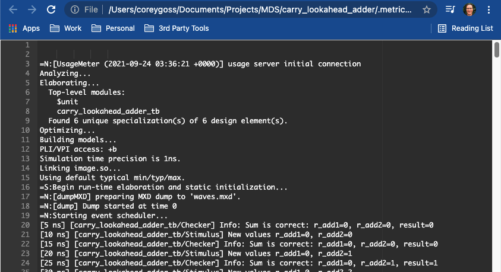
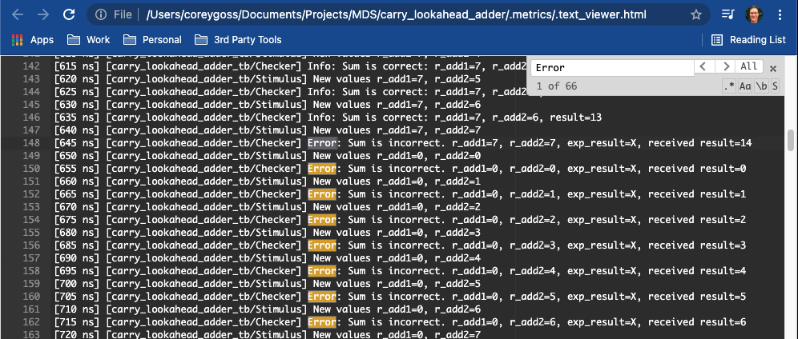
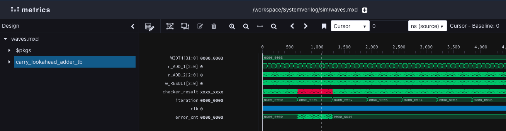
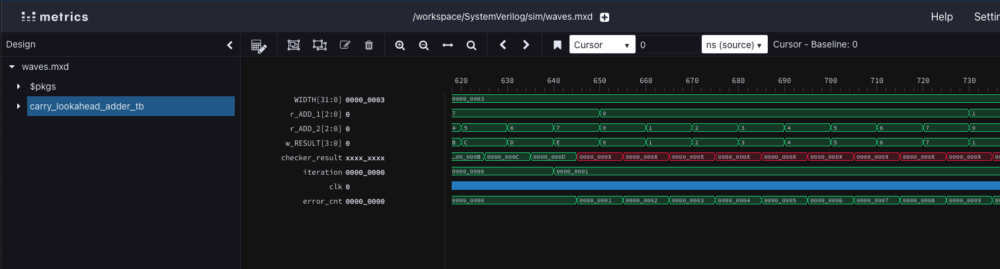

# CLI DemoWare Demo Steps
## Pre Demo
1.	Ensure that the demo code is up and available in whatever IDE/editor you are using
2.	Ensure that the error will be injected
3.	Kill all browsers prior to the demo unless you are using only a single screen
a.	This allows the remote viewers to “pop up” during the demo, as opposed to offscreen somewhere
4.	Ensure you do not have any dockers running
a.	Run a docker ps, then docker kill <Container ID>
b.	This prevents any unwanted warning/error messages when launching the waveform remote viewer

## Slide Presentation
5.	Present [these](https://docs.google.com/presentation/d/10VMnPzHgIM-8Bum0mlnw_p5UehZvZfiTS9GyfzDa8fw/edit?usp=sharing) slides to introduce CLI tool and flow to the customer

## Explain your Current Setup
6.	Explain your setup
    * I am working from my laptop
    * I develop on my laptop
    * I have downloaded and installed the CLI tool already
7.	`%> which mds`
    * Show where mds is being picked up from 
8.	`%> cd /path/to/your/demo/dir`
9.	Explain the contents of your directory and that you will be converting this directory into a workspace as it is at the top of your development tree

## Initialize the Workspace
10.	`%> mds init`
11.	`%> cd SystemVerilog/sim`
12.	`%> cat simulate.bash`
    * Explain that mds exec allows users to execute remote commands on the remote compute
    * Quickly state that you are running a simulation using the Metrics simulator, dsim

## Simulate your Design
13.	`%> ./simulate.bash`
14.	Explain: 
    * Standard out is echoed back to local terminal
    * Show that the simulation failed
    * Show that there are many print statements and it would be hard to find errors using scroll
15.	`%> ls` 
    * Show that no artifacts were stored locally, it’s all in the cloud
  
## View Artifacts
16.	`%> mds inspect`
    * Explain the tree and the differences in colouring
17.	`%> mds artifact view dsim.log` 
    * Show the browser
    * 
    * Ctrl-F 
    * Search for errors
    * Note the first error occurs at time Xns
    * 
18.	`%> mds artifact view waves.mxd`
    * Show the browser tab
    * Click on the carry_lookahead_adder_tb node
    * Send all signals to the waveform
    *  Zoom full and you should see something like this: 
    *  
    * In the time box of the waveform window, enter time X
    * Zoom in to see the X’s on the checker_result signal
    * 

## Fix the “Bug” and Resimulate
19.	Go to your favourite IDE/editor
    * Open the carry_lookahead_adder_directed_tb.v file and fix the error (search for TODO)
20.	`%> ./simulate.bsh`
    * Note: The simulation now passes
    * No need to reload the waveform/log

## Download Artifacts
21.	`%> mds artifact get dsim.log`
    * This will result in an error
22.	`%> mds artifact -h` 
    * Show the printout of the help system
    * (if setup properly) Show mds autocomplete usage. 
      * Eg: type `mds a<Tab>` (complete the command for artifacts) 
23.	`%> mds artifact download dsim.log`
    * Explain the _downloaded_artifact prefix
    * Explain that this could be useful for sending via email or whatever
    * Explain that the _downloaded* prefix is ignored by the file sync
24.	`%> mds inspect`  (Could use autocomplete feature here to get to the command, e.g.: `mds in<tab>`)
    * Show that the new _downloaded* files are in grey (local, ignored)

## Pause/Destroy the Workspace
25. `%> mds status`
    * Show that we are currently in an active workspace
    * Explain that billing occurs whenever the workspace is in the active state
26.	`%> mds workspace pause`
    * This is what the user may want to do at the end of their workday
27.	`%> mds inspect`
    * Show that you can still access the data/artifacts, just not able to perform compute operations
28.	`%> mds workspace resume`
    * How you startup in the morning
29.	`%> mds workspace destroy`
    * Removes all source code from the cloud 

